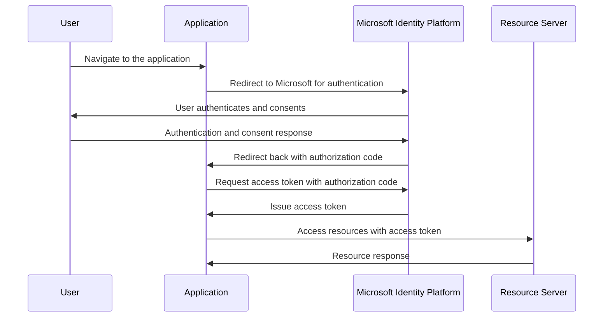
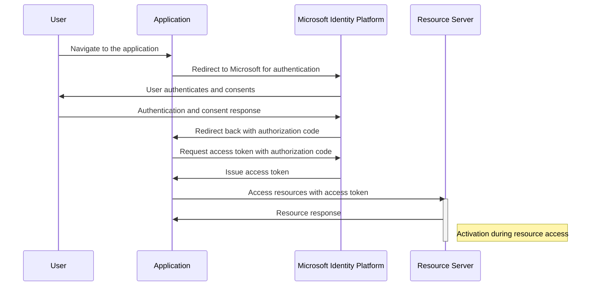
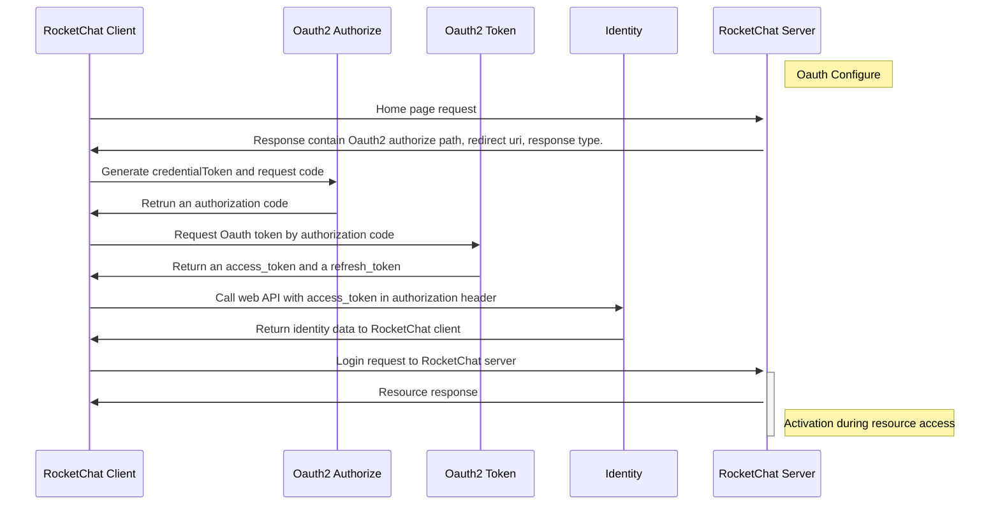

# Add diagrams with chatGPT


:::info[Useful links]

[`Mermaid lets you create diagrams and visualizations using text and code.`](https://mermaid.js.org/intro/)

[`Docusaurus and Mermaid Diagrams`](https://docusaurus.io/docs/markdown-features/diagrams)

[`Mermaid Live Editor to easily create detailed and diagrams on line`](https://mermaid.live/edit)

:::

I need to create one Sequence diagram like following, but do not know how to start. When I know there is one useful tool to draw diagram, so chatGPT with multimodal will help me start to use the tool qucikly.
Thanks to [`Mermaid Chart GPTs`](https://chatgpt.com/g/g-1IRFKwq4G-mermaid-chart-diagrams-and-charts). It can convert the authorization code flow picture to pieces of Mermaid codes, then make simple adaption of codes quickly, you will have the sequence diagram you oneself.
How to ask questions to this GPTs?


## Question: 

please convert the picture which discript the Microsoft authorization code flow to sequenceDiagram


## GPTs: 

To convert the Microsoft authorization code flow from the provided image to a sequence diagram, I'll follow these steps:

1. Analyze the SVG content to understand the flow.
2. Draft the corresponding sequenceDiagram in Mermaid syntax.
3. Render the diagram for verification.
Let's begin by summarizing the flow described in the SVG:

**Microsoft Authorization Code Flow Summary**
1. The user navigates to the application.
2. The application redirects the user to the Microsoft identity platform for authentication.
3. The user authenticates and consents to the requested permissions.
4. Microsoft identity platform redirects back to the application with an authorization code.
5. The application requests an access token from the Microsoft identity platform using the authorization code.
6. The Microsoft identity platform issues an access token.
7. The application uses the access token to access resources on behalf of the user.
Now, let's create the Mermaid diagram code for this flow

**GPTs to call the mermaidchart.com API with the Microsoft Authorization Code Flow Summary**
Based on the given flow, here is the Mermaid sequence diagram code for the Microsoft authorization code flow:

```js
sequenceDiagram
    participant User
    participant Application
    participant MicrosoftIdentityPlatform as Microsoft Identity Platform
    participant ResourceServer as Resource Server

    User->>Application: Navigate to the application
    Application->>MicrosoftIdentityPlatform: Redirect to Microsoft for authentication
    MicrosoftIdentityPlatform->>User: User authenticates and consents
    User->>MicrosoftIdentityPlatform: Authentication and consent response
    MicrosoftIdentityPlatform->>Application: Redirect back with authorization code
    Application->>MicrosoftIdentityPlatform: Request access token with authorization code
    MicrosoftIdentityPlatform->>Application: Issue access token
    Application->>ResourceServer: Access resources with access token
    ResourceServer->>Application: Resource response
```

**Then GPTs render this diagram to confirm its validity and draw the diagram.**



## Question: 

please add one Activation from resource server to application, and add the note to the Activation.


## GPTs: 

Here is the updated Mermaid sequence diagram code with an activation from the Resource Server to the Application, including a note on the activation:

```js
sequenceDiagram
    participant User
    participant Application
    participant MicrosoftIdentityPlatform as Microsoft Identity Platform
    participant ResourceServer as Resource Server

    User->>Application: Navigate to the application
    Application->>MicrosoftIdentityPlatform: Redirect to Microsoft for authentication
    MicrosoftIdentityPlatform->>User: User authenticates and consents
    User->>MicrosoftIdentityPlatform: Authentication and consent response
    MicrosoftIdentityPlatform->>Application: Redirect back with authorization code
    Application->>MicrosoftIdentityPlatform: Request access token with authorization code
    MicrosoftIdentityPlatform->>Application: Issue access token
    Application->>ResourceServer: Access resources with access token
    activate ResourceServer
    ResourceServer->>Application: Resource response
    Note right of ResourceServer: Activation during resource access
    deactivate ResourceServer

```

**Then GPTs render this diagram to confirm its validity and draw the diagram.**







