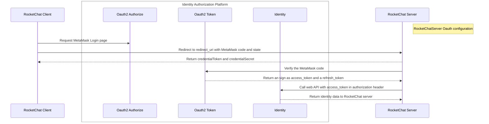

# Rocketchat with MetaMask Authorization flow

## RocketChat with MetaMask Oauth2 overview



## RocketChatServer MetaMask Oauth configuration
To create a custom authentication method in your Rocket.Chat workspace:

- Navigate to Administration > Workspace > Settings > OAuth.

- Click on Custom OAuth and set the new OAuth integration name.

- After creating the new integration, you are given the Callback URL. Provide this as the redirect URI when you are creating your Azure app.

- You will also need to fill in other configuration fields.

For more detialed info please see the [`Auth with Microsoft code flow`](https://vulnsystem.github.io/docs/rocketchat/rocketchat-microsoft-oauth)


## Request MetaMask Login page
The following page will be loaded according to the RocketChatServer MetaMask Oauth configuration
```js
<script src="https://c0f4f41c-2f55-4863-921b-sdk-docs.github.io/cdn/metamask-sdk.js"></script>
    
<script>
  //highlight-start
  const sdk = new MetaMaskSDK.MetaMaskSDK({
    dappMetadata: {
      name: "RocketChat with MetaMask Oauth",
    },
    logging: {
      sdk: false,
    }
  });
  //highlight-end
</script>
<script>
  let provider;

  function redirectTo(timestamp, account, sign) {
    const url = new URL(window.location.href);
    // Get the query parameters
    const params = new URLSearchParams(url.search);
    // Iterate through all parameters
    params.forEach((value, name) => {
        console.log(name, value);
    });
    //highlight-start
    const code = [timestamp, account, sign].join('.');
    const redirectUrl = `${params.get('redirect_uri')}?code=${code}&state=${encodeURIComponent(params.get('state'))}`;
    //highlight-end
    console.log(redirectUrl)
    //highlight-start
    window.location.href = redirectUrl;
    //highlight-end
  }


  /**
   * Sign Typed Data V4
   */
   async function generateCode () {
    const accounts = await sdk.connect();
    provider = sdk.getProvider();

    const msgParams = {
      domain: {
        chainId: '0x1',
        name: 'RocketChat Login',
        verifyingContract: '0xCcCCccccCCCCcCCCCCCcCcCccCcCCCcCcccccccC',
        version: '1',
      },
      message: {
        account: '0xABCD',
        timestamp: 0,
      },
      primaryType: 'Code',
      types: {
        EIP712Domain: [
          { name: 'name', type: 'string' },
          { name: 'version', type: 'string' },
          { name: 'chainId', type: 'uint256' },
          { name: 'verifyingContract', type: 'address' },
        ],
        Code: [
          { name: 'account', type: 'string' },
          { name: 'timestamp', type: 'uint256' },
        ],
      },
    };

    try {
      //highlight-start
      const from = accounts[0];
      msgParams.message.account = from;
      msgParams.message.timestamp = Math.floor(Date.now()/1000);
      const sign = await provider.request({
        method: 'eth_signTypedData_v4',
        params: [from, JSON.stringify(msgParams)],
      });
      console.log(sign);
      //highlight-end

      redirectTo(msgParams.message.timestamp, from, sign);

    } catch (err) {
      console.error(err);
    }
  };

  window.onload = generateCode;
</script>

```

### Create MetaMask provider and pending to connect
MetaMask SDK is a library that provides a reliable, secure, and seamless connection from your dapp to the MetaMask browser extension and MetaMask Mobile. You can install the SDK in existing dapps, and call any Wallet API methods from your dapp.  When connect function execution, the connection RPC link will be generated, the user will connect with extension and mobile app. After connected with RPC link, MetaMask SDK will generate one provider, whcih will used to sign the data.

### Create MetaMask code
MetaMask code is composed by timestamp, account and sign, which is generated by Metamask client when user login with MetaMask browser plugin. So the MetaMask code is different from the Oauth2 auth code which generated by Oauth2 Identity Authorization Platform.
MetaMask codes are typically designed for single use. A short lifespan ensures that if an attacker attempts to use a captured code multiple times, it will quickly become invalid.

```js title="MetaMask Code"
code=1721629896.0x251aeaf02504f244f268d9886bee324e5cbb2bd6.0xef77ada92489d08215e1888ef663ba4631eece2460597b1ac44dd0b41f021a0e2dddce190b425e9b7e730fca4a3f807c939ff19c6ba668d330ef71440f4cbbcd1b
```
:::info
- timestamp = 1721629896
- account = 0x251aeaf02504f244f268d9886bee324e5cbb2bd6
- sign = 0xef77ada92489d08215e1888ef663ba4631eece2460597b1ac44dd0b41f021a0e2dddce190b425e9b7e730fca4a3f807c939ff19c6ba668d330ef71440f4cbbcd1b
- account == recoverTypedSignature(timestamp, sign)
:::

## Redirect to redirect_uri with MetaMask code and state
The function redirectTo constructs a URL with specific query parameters and redirects the browser to this URL. 
Create a URL object from the current window location. Retrive the state and redirect_uri from the current window location.
Construct the code by joining timestamp, account, and sign with a period (.).
Build the redirectUrl using the redirect_uri and state parameters from the original URL, appending the code as a query parameter.
Redirect the browser to the constructed URL.

```js title="Current window location"
Get /metamask/authorize?<br>
client_id=6c66e5cda6c13bc80f7c8c24e00ff5d4077e1da97eca78e53755177c5591b220&<br>
redirect_uri=https%3A%2F%2F212c-34-92-204-228.ngrok-free.app%2F_oauth%2Fmeta&<br>
response_type=code&<br>
state=eyJsb2dpblN0eWxlIjoicmVkaXJlY3QiLCJjcmVkZW50aWFsVG9rZW4iOiIwOEh6LTdHbmdscEhoOUJsYng4WHZXLThfTGhZUENXUXhQVnBWS0lmSHI5IiwiaXNDb3Jkb3ZhIjpmYWxzZSwicmVkaXJlY3RVcmwiOiJodHRwczovLzIxMmMtMzQtOTItMjA0LTIyOC5uZ3Jvay1mcmVlLmFwcC9ob21lIn0%3D&<br>
scope=openid%20profile%20email
```

```js title="New redirectUrl"
const redirectUrl = `${params.get('redirect_uri')}?code=${code}&state=${encodeURIComponent(params.get('state'))}`;

https%3A%2F%2F212c-34-92-204-228.ngrok-free.app%2F_oauth%2Fmeta/?<br>
code=1721629896.0x251aeaf02504f244f268d9886bee324e5cbb2bd6.0xef77ada92489d08215e1888ef663ba4631eece2460597b1ac44dd0b41f021a0e2dddce190b425e9b7e730fca4a3f807c939ff19c6ba668d330ef71440f4cbbcd1b<br>
state=eyJsb2dpblN0eWxlIjoicmVkaXJlY3QiLCJjcmVkZW50aWFsVG9rZW4iOiIwOEh6LTdHbmdscEhoOUJsYng4WHZXLThfTGhZUENXUXhQVnBWS0lmSHI5IiwiaXNDb3Jkb3ZhIjpmYWxzZSwicmVkaXJlY3RVcmwiOiJodHRwczovLzIxMmMtMzQtOTItMjA0LTIyOC5uZ3Jvay1mcmVlLmFwcC9ob21lIn0%3D<br>

```

## Return credentialToken and credentialSecret
This step is same as [RocketChat Oauth flow](https://vulnsystem.github.io/docs/rocketchat/rocketchat-oauth-process#return-credentialtoken-and-credentialsecret).

## Verify the MetaMask code
## Return an sign as access_token and a refresh_token
## Call web API with access_token in authorization header
## Return identity data to RocketChat server


:::info
- **credentialToken** in all steps must be same in one login session.
- **redirect_uri** in all steps must be same in one login session.
- **state** in all steps must be same in one login session.
:::
