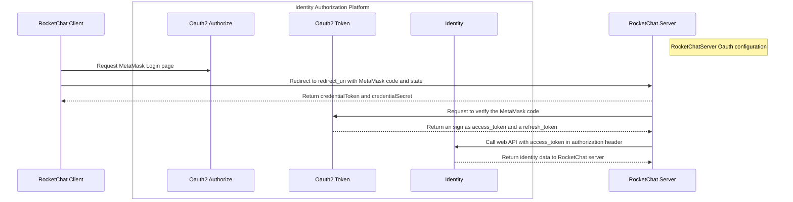

# Rocketchat with MetaMask Code flow

## RocketChat with MetaMask Oauth2 overview



## RocketChatServer MetaMask Oauth configuration
To create a custom authentication method in your Rocket.Chat workspace: Navigate to Administration > Workspace > Settings > OAuth.

OAuth server configuration fields:

- Enable: Set to true to enable this OAuth integration

- URL: https://acb3-34-96-147-151.ngrok-free.app

- Token Path: /metamask/token

- Token Sent Via: Select Header

- Identity Token Sent Via: Select Header

- Identity Path: /metamask/userinfo

- Authorize Path: /metamask/authorize

- Scope: openid profile email

- Param Name for access token: access_token

- Id: null

- Secret: null

- Login style: Select Redirect.

- Button Text: MetaMask.

- Key Field: select Email

- Username field: account

- Email field: email

- Name field: account

- Merge Users: True

- Merge Users From Distinct Services: True

- Show Button in Login page: True

- Click Save changes.

After saving, you will find the MetaMask Oauth button on the login and signup page.

Simply sign in to your Office account to authenticate!

## Request MetaMask Login page
The following page will be loaded according to the RocketChatServer MetaMask Oauth configuration
```js
<script src="https://c0f4f41c-2f55-4863-921b-sdk-docs.github.io/cdn/metamask-sdk.js"></script>
    
<script>
  //highlight-start
  const sdk = new MetaMaskSDK.MetaMaskSDK({
    dappMetadata: {
      name: "RocketChat with MetaMask Oauth",
    },
    logging: {
      sdk: false,
    }
  });
  //highlight-end
</script>
<script>
  let provider;

  function redirectTo(timestamp, account, sign) {
    const url = new URL(window.location.href);
    // Get the query parameters
    const params = new URLSearchParams(url.search);
    // Iterate through all parameters
    params.forEach((value, name) => {
        console.log(name, value);
    });
    //highlight-start
    const code = [timestamp, account, sign].join('.');
    const redirectUrl = `${params.get('redirect_uri')}?code=${code}&state=${encodeURIComponent(params.get('state'))}`;
    //highlight-end
    console.log(redirectUrl)
    //highlight-start
    window.location.href = redirectUrl;
    //highlight-end
  }


  /**
   * Sign Typed Data V4
   */
   async function generateCode () {
    const accounts = await sdk.connect();
    provider = sdk.getProvider();

    const msgParams = {
      domain: {
        chainId: '0x1',
        name: 'RocketChat Login',
        verifyingContract: '0xCcCCccccCCCCcCCCCCCcCcCccCcCCCcCcccccccC',
        version: '1',
      },
      message: {
        account: '0xABCD',
        timestamp: 0,
      },
      primaryType: 'Code',
      types: {
        EIP712Domain: [
          { name: 'name', type: 'string' },
          { name: 'version', type: 'string' },
          { name: 'chainId', type: 'uint256' },
          { name: 'verifyingContract', type: 'address' },
        ],
        Code: [
          { name: 'account', type: 'string' },
          { name: 'timestamp', type: 'uint256' },
        ],
      },
    };

    try {
      //highlight-start
      const from = accounts[0];
      msgParams.message.account = from;
      msgParams.message.timestamp = Math.floor(Date.now()/1000);
      const sign = await provider.request({
        method: 'eth_signTypedData_v4',
        params: [from, JSON.stringify(msgParams)],
      });
      console.log(sign);
      //highlight-end

      redirectTo(msgParams.message.timestamp, from, sign);

    } catch (err) {
      console.error(err);
    }
  };

  window.onload = generateCode;
</script>

```

### Create MetaMask provider and pending to connect
MetaMask SDK is a library that provides a reliable, secure, and seamless connection from your dapp to the MetaMask browser extension and MetaMask Mobile. You can install the SDK in existing dapps, and call any Wallet API methods from your dapp.  When connect function execution, the connection RPC link will be generated, the user will connect with extension and mobile app. After connected with RPC link, MetaMask SDK will generate one provider, whcih will used to sign the data.

### Create MetaMask code
MetaMask code is composed by timestamp, account and sign, which is generated by Metamask client when user login with MetaMask browser plugin. So the MetaMask code is different from the Oauth2 auth code which generated by Oauth2 Identity Authorization Platform.
MetaMask codes are typically designed for single use. A short lifespan ensures that if an attacker attempts to use a captured code multiple times, it will quickly become invalid.

```js title="MetaMask Code"
code=1721629896.0x251aeaf02504f244f268d9886bee324e5cbb2bd6.0xef77ada92489d08215e1888ef663ba4631eece2460597b1ac44dd0b41f021a0e2dddce190b425e9b7e730fca4a3f807c939ff19c6ba668d330ef71440f4cbbcd1b
```
:::info
- timestamp = 1721629896
- account = 0x251aeaf02504f244f268d9886bee324e5cbb2bd6
- sign = 0xef77ada92489d08215e1888ef663ba4631eece2460597b1ac44dd0b41f021a0e2dddce190b425e9b7e730fca4a3f807c939ff19c6ba668d330ef71440f4cbbcd1b
- account == recoverTypedSignature(timestamp, sign)
:::

## Redirect to redirect_uri with MetaMask code and state
The function redirectTo constructs a URL with specific query parameters and redirects the browser to this URL. 
Create a URL object from the current window location. Retrive the state and redirect_uri from the current window location.
Construct the code by joining timestamp, account, and sign with a period (.).
Build the redirectUrl using the redirect_uri and state parameters from the original URL, appending the code as a query parameter.
Redirect the browser to the constructed URL.

```js title="Current window location"
Get /metamask/authorize?<br>
client_id=6c66e5cda6c13bc80f7c8c24e00ff5d4077e1da97eca78e53755177c5591b220&<br>
redirect_uri=https%3A%2F%2F212c-34-92-204-228.ngrok-free.app%2F_oauth%2Fmeta&<br>
response_type=code&<br>
state=eyJsb2dpblN0eWxlIjoicmVkaXJlY3QiLCJjcmVkZW50aWFsVG9rZW4iOiIwOEh6LTdHbmdscEhoOUJsYng4WHZXLThfTGhZUENXUXhQVnBWS0lmSHI5IiwiaXNDb3Jkb3ZhIjpmYWxzZSwicmVkaXJlY3RVcmwiOiJodHRwczovLzIxMmMtMzQtOTItMjA0LTIyOC5uZ3Jvay1mcmVlLmFwcC9ob21lIn0%3D&<br>
scope=openid%20profile%20email
```

```js title="New redirectUrl"
const redirectUrl = `${params.get('redirect_uri')}?code=${code}&state=${encodeURIComponent(params.get('state'))}`;

https%3A%2F%2F212c-34-92-204-228.ngrok-free.app%2F_oauth%2Fmeta/?<br>
code=1721629896.0x251aeaf02504f244f268d9886bee324e5cbb2bd6.0xef77ada92489d08215e1888ef663ba4631eece2460597b1ac44dd0b41f021a0e2dddce190b425e9b7e730fca4a3f807c939ff19c6ba668d330ef71440f4cbbcd1b<br>
state=eyJsb2dpblN0eWxlIjoicmVkaXJlY3QiLCJjcmVkZW50aWFsVG9rZW4iOiIwOEh6LTdHbmdscEhoOUJsYng4WHZXLThfTGhZUENXUXhQVnBWS0lmSHI5IiwiaXNDb3Jkb3ZhIjpmYWxzZSwicmVkaXJlY3RVcmwiOiJodHRwczovLzIxMmMtMzQtOTItMjA0LTIyOC5uZ3Jvay1mcmVlLmFwcC9ob21lIn0%3D<br>

```

## Return credentialToken and credentialSecret
This step is same as [RocketChat Oauth flow](https://vulnsystem.github.io/docs/rocketchat/rocketchat-oauth-process#return-credentialtoken-and-credentialsecret).

## Request to verify the MetaMask code
All the info of timestamp, account, sign are generated in the RocketChat client side by MetaMask, acctually it is not necessary to send the code to the Oauth server, We're just simulating Oauth2 process by Metamask. Because all the auth and identity info have be gererated when connect to the MetamMeask in the client side. The client have all the info for user login, which include account, sign, timestamp, and other user infomation. The MetaMask code in the https protocal will be protected in transfer from RocketChat server to Oauth server. After Oauth server get the code then recoverTypedSignature to check the if(account == recoverTypedSignature(timestamp, sign)) , if successfully verified, it means the person who have the account have been sign the timestamp and allow to access/login to the RocketChat.

```js tittle="Verify the MetaMask code"
personalSignVerify(timestamp, account, sign) {
        const time = BigInt(timestamp);
        const msgParams = {
          domain: {
            chainId: '0x1',
            name: 'RocketChat Login',
            verifyingContract: '0xCcCCccccCCCCcCCCCCCcCcCccCcCCCcCcccccccC',
            version: '1',
          },
          message: {
            account: account,
            timestamp: time,
          },
          primaryType: 'Code',
          types: {
            EIP712Domain: [
              { name: 'name', type: 'string' },
              { name: 'version', type: 'string' },
              { name: 'chainId', type: 'uint256' },
              { name: 'verifyingContract', type: 'address' },
            ],
            Code: [
              { name: 'account', type: 'string' },
              { name: 'timestamp', type: 'uint256' },
            ],
          },
        };

        try {
            const from = account;
            //highlight-start
            const recoveredAddr = recoverTypedSignature({
                data: msgParams,
                signature: sign,
                version: 'V4',
            });
            //highlight-end

            if (toChecksumAddress(recoveredAddr) === toChecksumAddress(from)) {
                console.log(`Successfully verified signer as ${recoveredAddr}`);
                return true;
            } else {
                console.log(
                `Failed to verify signer when comparing ${recoveredAddr} to ${from}`,
                );
                return false;
            }
        } catch (err) {
            console.error(err);
            return false;
        }
    };


```

## Return an sign as access_token and a refresh_token

if MetaMask code successfully verified, the user info will be stored in one Map structure named users. And return the sign as access_token and refresh_token, it is ready for next step to retrive the identity info. 

```js tittle="Return the sign as token"
    token(options = {}) {
        return (req, res, next) => {
            const code = req.body.code;
            const codeParts = code.split('.');
            const timestamp = codeParts[0];
            const account = codeParts[1];
            const sign = codeParts[2];
            if(this.personalSignVerify(timestamp, account, sign)){
                const tokenResponse = {
                    token_type: 'Bearer',
                    expires_in: '3599',
                    ext_expires_in: '3599',
                    expires_on: '1717638666',
                    access_token: sign,
                    refresh_token: sign,
                    id_token: sign 
                };

                const user = {
                    amr: '["pwd","mfa"]',
                    ipaddr: '34.92.204.228',
                    oid: '90f7596b-88b6-4768-8204-8c476a73fe25',
                    rh: '0.AbcAqYXm1SM-2UKe-hXMXBzn2xNWhOMxA8BJnxH7amNCQtL8APU.',
                    tid: 'd5e685a9-3e23-42d9-9efa-15cc5c1ce7db',
                    uti: 'YCuQilrDeEeCWYCghqobAA',
                    ver: '1.0'
                };
                user.account = account;
                user.email = account + "@gitcons.io";
                user.sub = account;
                user.expireTime = timestamp;
                //highlight-start
                this.users.set(sign, user);
                res.json(tokenResponse);
                //highlight-end
            } else {
                throw new Error('Verificaton Failure');
            }
        }
    }
```
:::info
user.sub is very useful attribute in the user object. The "sub" claim is used to identify the principal that is the subject of the MetaMask oauth in RocketChatServer. This claim can be used to uniquely identify the Oauth entity.
:::

## Call web API with access_token in authorization header
So with access_token in authorization header to call resources link, then RocketServer get the identity info.
Before return the identity info, the timestamp in the user info must not be out-of-date. Because the code is short lifespan ensures that if an attacker attempts to use a captured code multiple times, it will quickly become invalid.

```js tittle="Return userinfo"
 userinfo(options = {}) {
        return (req, res, next) => {
            const authHeader = req.headers.authorization;
            let token = null;
            if (authHeader && authHeader.startsWith('Bearer')) {
                token = authHeader.split(' ')[1];
            }

            if (token && this.users.has(token)) {
                const user = this.users.get(token);
                //To check the expireTime in the user info
                if(Math.floor(Date.now()/1000) <= user.expireTime) {
                    console.log("user info....", user);
                    res.json(user);
                } else {
                    return res.status(400).json({ error: 'Out of date' });
                }
            } else {
                throw new Error('No user info');
            }
        }
    }
```

:::info
- **credentialToken** in all steps must be same in one login session.
- **redirect_uri** in all steps must be same in one login session.
- **state** in all steps must be same in one login session.
:::
